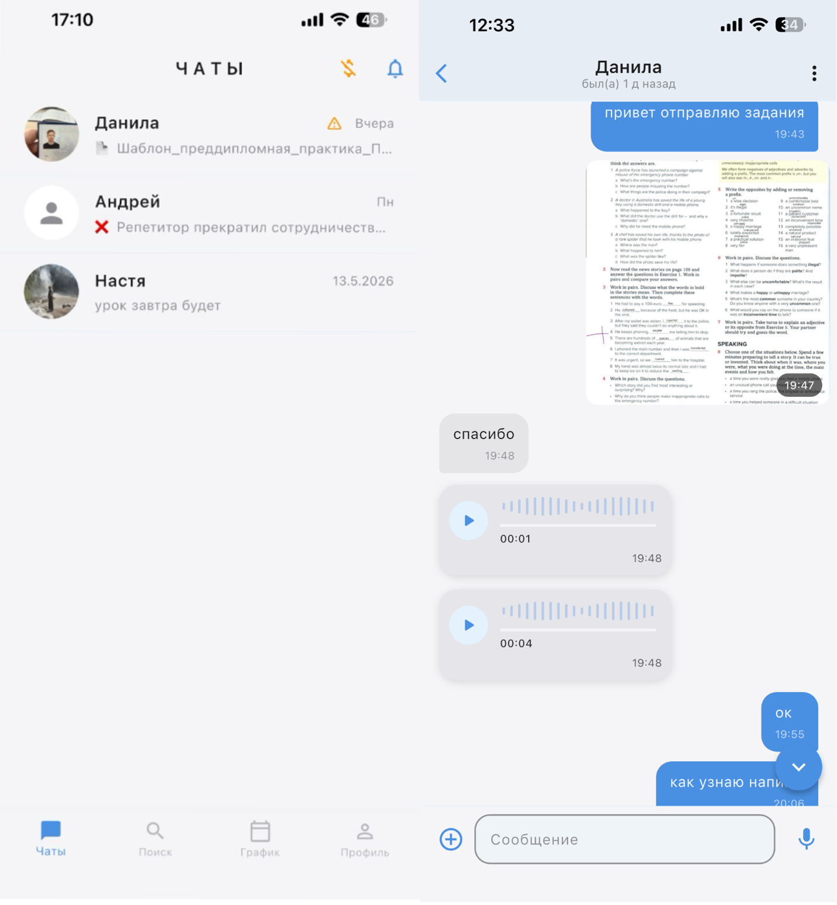
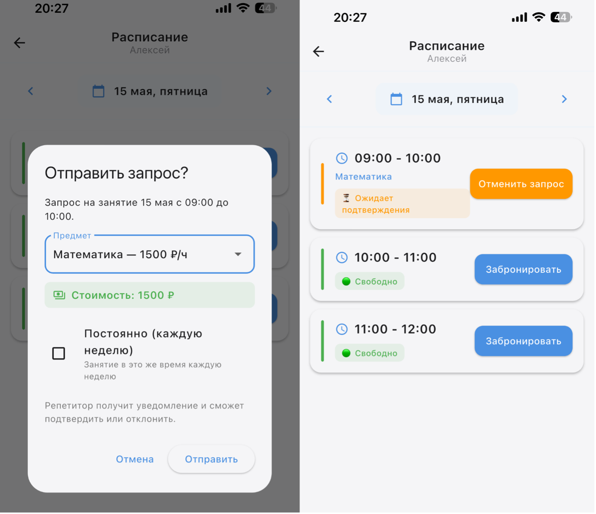
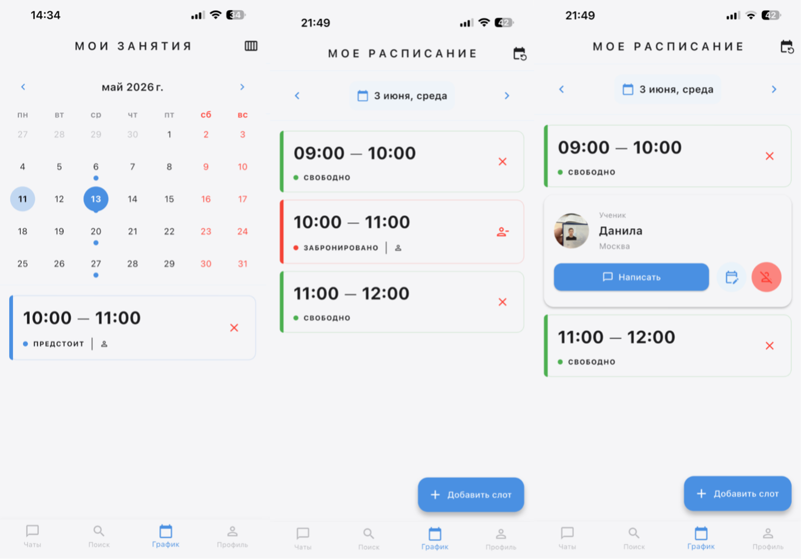
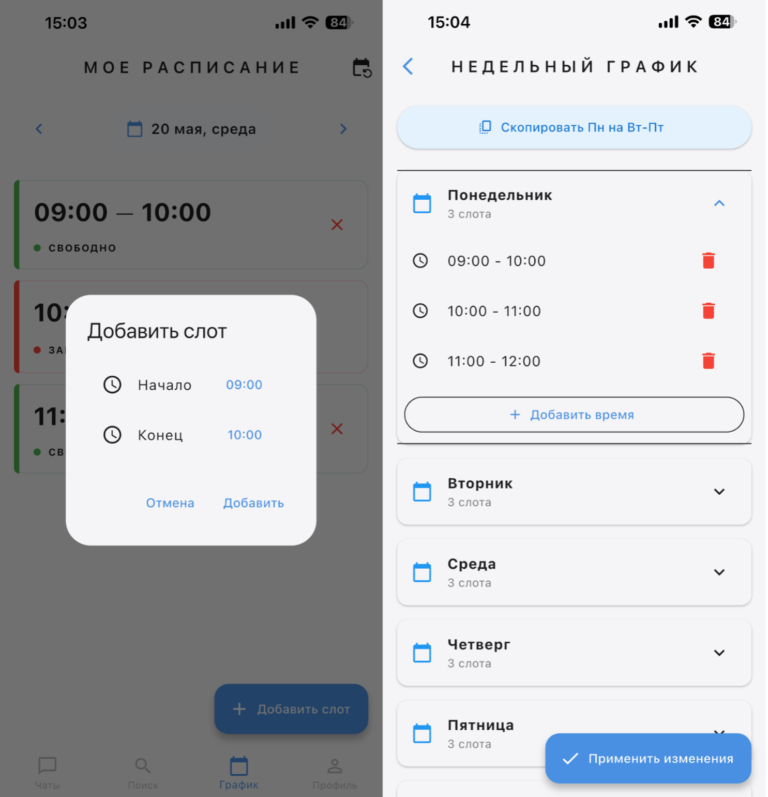
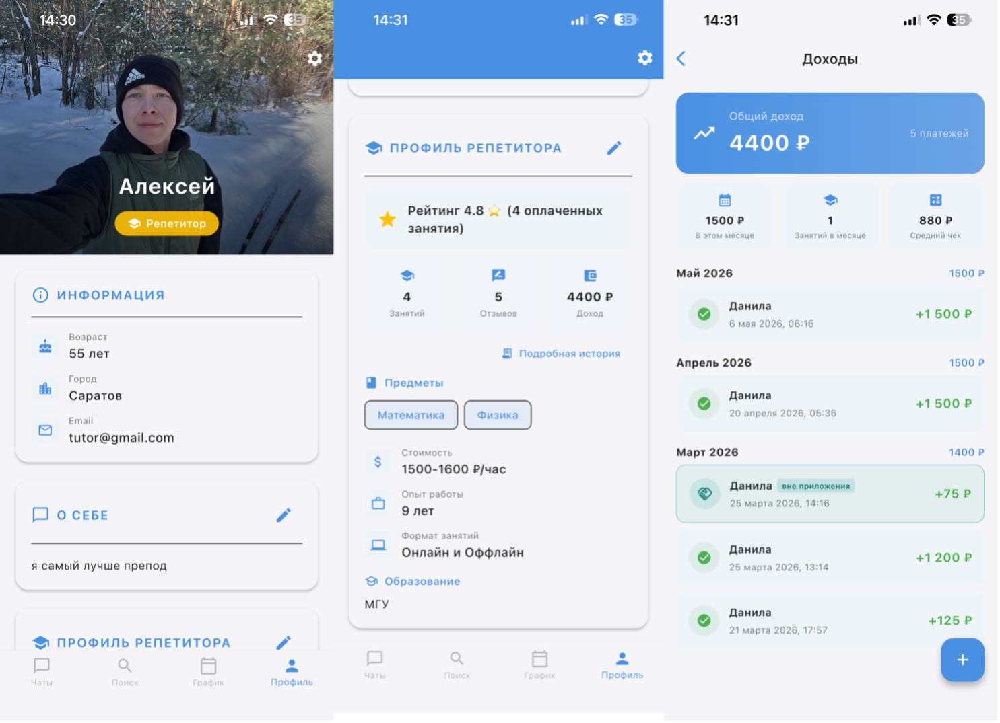
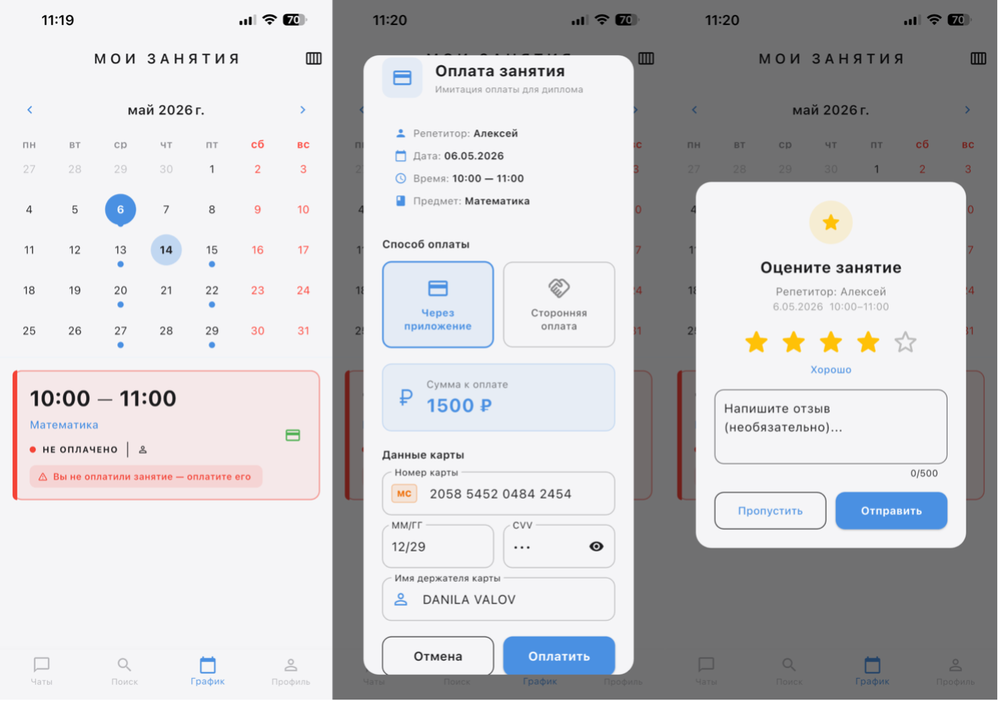

<div align="center">

# Учёба рядом

**Приложение для поиска репетиторов и организации занятий**

[](https://flutter.dev)
[](https://dart.dev)
[](https://pocketbase.io)
[](https://www.docker.com)
[](LICENSE)

</div>

---

## О проекте

Кроссплатформенное мобильное приложение: ученик находит репетитора, бронирует время
в его расписании, общается в чате, оплачивает занятие и оставляет отзыв.

Две роли с разными интерфейсами:

- **Ученик** — ищет репетитора по предмету и рейтингу, бронирует слоты, оплачивает занятия, пишет отзывы
- **Репетитор** — настраивает недельный график, подтверждает заявки, ведёт профиль с предметами и ценами, смотрит статистику доходов

Бэкенд — PocketBase в Docker на собственном VPS. Авторизация, база, файловое
хранилище и realtime-подписки в одном сервисе.

---

## Скриншоты

**Чаты**  — текст, фото, файлы и голосовые сообщения, счётчик непрочитанных



**Бронирование** — ученик выбирает свободный слот и предмет, репетитор подтверждает



**Календарь занятий** — занятия ученика и расписание репетитора с карточкой записавшегося



**Недельный график** — шаблон рабочей недели, слоты создаются автоматически



**Профиль и доходы** — предметы, цены, рейтинг, статистика по платежам



**Оплата и отзыв** — оплата картой или отметка перевода вне приложения, затем оценка



---

## Возможности

### Чаты
- Текстовые сообщения, изображения, произвольные файлы, голосовые сообщения
- Запись и воспроизведение аудио в чате с визуализацией волны
- Realtime-обновление через WebSocket-подписки PocketBase
- Счётчик непрочитанных, статус «был(а) в сети»
- Блокировка пользователей и жалобы на сообщения

### Расписание
- Слоты создаются вручную или генерируются из недельного шаблона на 28 дней вперёд
- Кнопка «Скопировать Пн на Вт–Пт» для быстрой настройки недели
- Бронирование с подтверждением: `свободно → ожидает → подтверждено`
- Постоянное расписание — бронь одного времени еженедельно на 3 месяца вперёд
- Перенос и отмена занятий, отмена всей серии повторяющихся броней

### Оплата
- Имитация оплаты картой с валидацией номера, срока и CVV
- Отметка платежа, прошедшего вне приложения
- История платежей и статистика: общий доход, доход за месяц, средний чек
- Реквизиты карты сохраняются локально, чтобы не вводить их заново

### Рейтинг и отзывы
- Отзыв доступен только после оплаченного занятия
- Взвешенный рейтинг: вес отзыва растёт с числом занятий у одного ученика
- Ранжированный поиск — на выдачу влияют рейтинг, число занятий и активность
- Бейдж для новых репетиторов

### Профили
- Профиль репетитора: предметы, цена по каждому предмету, опыт, образование, формат занятий
- Аватар с генерацией превью на стороне сервера
- Определение города по геолокации
- Светлая и тёмная темы, локализация ru/en

---

## Технологии

| Слой | Инструменты |
|---|---|
| Фреймворк | Flutter 3.7, Dart |
| Состояние | Provider (`ChangeNotifier`) |
| Бэкенд | PocketBase 0.23 — SQLite, Auth, File Storage, Realtime |
| Инфраструктура | Docker, docker-compose, VPS |
| Медиа | `flutter_sound`, `audioplayers`, `image_picker`, `file_picker`, `cached_network_image` |
| Устройство | `geolocator`, `geocoding`, `permission_handler`, `flutter_local_notifications` |
| UI | Material 3, `table_calendar`, `intl` |

---

## Архитектура

```
lib/
├── main.dart                 # Точка входа, инициализация сервисов и провайдеров
├── config/                   # Конфигурация подключения к серверу
├── models/                   # User, Chat, Message, ScheduleSlot, Payment, Review
├── service/                  # Бизнес-логика и работа с PocketBase
│   ├── pocketbase_service    # Singleton-клиент PocketBase
│   ├── auth / auth_gate      # Авторизация и роутинг по состоянию сессии
│   ├── chat_service          # Сообщения, файлы, realtime, непрочитанные
│   ├── schedule_service      # Слоты, бронирование, постоянные занятия
│   ├── weekly_template_...   # Генерация слотов из недельного шаблона
│   ├── payment_service       # Платежи и статистика доходов
│   ├── review_service        # Отзывы и взвешенный рейтинг
│   └── cache_service         # Локальное кеширование
├── pages/                    # Экраны приложения
├── components/               # Переиспользуемые виджеты
└── themes/                   # Светлая и тёмная темы
```

Три решения, определившие структуру:

**Метаданные чатов отдельно от сообщений.** Коллекция `chats` хранит последнее
сообщение и счётчики непрочитанных, `messages` — саму переписку. Список диалогов
грузится одним лёгким запросом, без выборки всей истории.

**Шаблон недели отдельно от слотов.** `weekly_templates` описывает абстрактный
график («каждый понедельник 10:00–12:00»), `slots` — конкретные даты. Пересборка
расписания не затрагивает уже забронированные занятия.

**Группировка повторяющихся броней.** Занятия постоянного расписания получают общий
`recurringGroupId` — отмена всей серии выполняется одним запросом.

Полная схема БД с типами полей, индексами и связями — [`database_schema.dbml`](database_schema.dbml),
визуализация на [dbdiagram.io](https://dbdiagram.io/). Разбор отдельных подсистем — в [`docs/`](docs/).

---

## Запуск

Требуются Flutter SDK 3.7+, Docker и Android Studio либо Xcode.

**1. Бэкенд**

```bash
cd pocketbase
docker-compose up -d
```

Admin-панель — `http://localhost:8090/_/`. При первом запуске создайте администратора;
коллекции развернутся из [`pocketbase/pb_migrations/`](pocketbase/pb_migrations).

**2. Подключение**

Создайте `lib/config/server_config.dart` — в репозитории его нет:

```dart
class ServerConfig {
  static const String localUrl = 'http://10.0.2.2:8090'; // Android-эмулятор
  static const String vpsUrl   = 'http://ВАШ_IP:8090';   // Продакшен
}
```

Для iOS-симулятора — `http://localhost:8090`, для физического устройства — IP компьютера
в локальной сети.

**3. Приложение**

```bash
flutter pub get
flutter run
```

---

## Лицензия

[MIT](LICENSE)
